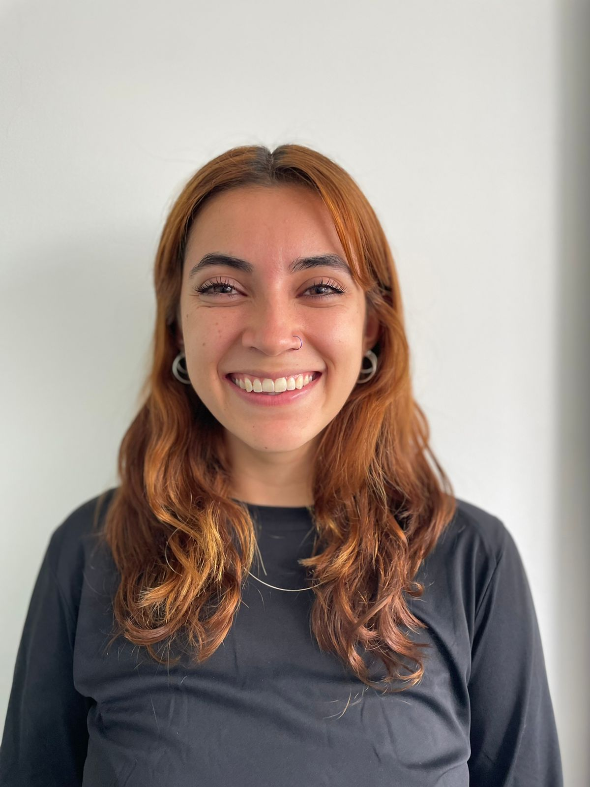

# Carolina Crosby Jiménez  
## Profesional en periodismo y opinión pública con mención en sociología - 26 años    

## Perfil
Profesional en periodismo y opinión pública con mención en Sociología de la Universidad del Rosario y formación en Ciencias Humanas. Cuento con habilidades comunicativas y de trabajo en equipos interdisciplinarios. Mi principal interés es la  investigación social relacionada con la producción audiovisual y redacción de textos - Periodismo investigativo. Tengo dominio en el manejo de contenidos en redes sociales como Twitter, Facebook e Instagram y contenido en páginas web (WordPress).
   
_____

## Formación Académica
* Maestría en Humanidades Digitales - Universidad de los Andes (2022 - Actualidad) 

* Periodismo y opinión pública - Universidad del Rosario (2014 - 2020) 

* Estudios de mención en sociología - Universidad del Rosario 
   
____

## Formación Complementaria
* Capacitación "Cómo informar acerca de la violencia de género" - Jineth Bedoya Lima (2021)

* Curso Primeros Auxilios Psicológicos - Universidad del Rosario (2020 - 1)

* Curso Actualización en Derecho Ambiental - Universidad del Rosario (2020 - 1)

* Diplomado en violencias de género en el camino hacia la paz - Universidad del Rosario (2017-2) 
    
____

## Experiencia profesional 
 

**Universidad de los Andes**  
Asistencia graduada docente *(Agosto 2022 - actualidad)*  
*  Asistencia docente en clases de pregrado de la escuela de posgrados de la Facultad de Arte y Humanidades    

**Universidad del Rosario - Observatorio de Tierras**  

Joven investigadora Minciencias *(noviembre 2021 - actualidad)*  
Periodista e investigadora  *(marzo 2020 - actualidad)* 
* Corrección de estilo y diagramación de informes y artículos académicos  
    * [Producto diagramación y corrección de estilo](https://www.observatoriodetierras.org/wp-content/uploads/2021/08/Informe-fumigaciones.pdf)

* Manejo de redes sociales ([Twitter](https://twitter.com/TierrasObserva) y [Facebook](https://www.facebook.com/TierrasObserva)) y Producción del [Podcast](https://www.observatoriodetierras.org/podcast/)

*  Editora de contenido de columnas de opinión y blogs para El Espectador
    * Blog  ["Con los pies en la tierra"](https://blogs.elespectador.com/author/observatoriodetierras)
    * Opinión [Colombia +20](https://www.elespectador.com/opinion/columnistas/observatorio-de-restitucion-y-regulacion-de-derechos-de-propiedad-agraria/) 

* Manejo y diseño de contenido de la [página web](https://www.observatoriodetierras.org/)

* Diseño y producción de piezas audiovisuales 
    * [Producto trabajo diseño y visualización](https://www.observatoriodetierras.org/erradicamos-la-coca-y-ahora-que-la-sustitucion-desde-las-voces-de-los-usuarios-del-pnis-en-tumaco/) 
  

**Universidad del Rosario - Educación Continua**  
Monitora Administrativa
* Monitora administrativa y soporte en logística *(2017-2   -   2021-1)*

    * Manejo de cursos presenciales y virtuales

    * Apoyo logístico en seminarios
  

**Prácticas profesionales - Manos a la paz**  
Municipio de Dibulla, La Guajira *(marzo 2018 - agosto 2018)* 

* Cubrir contenido de redes para Alcaldía municipal de Dibulla

* Participación en programa Active Citizens del British Council

* Apoyo Agencia Nacional de Tierras  - Cartografías sociales veredales

* Apoyo Agencia de Renovación del Territorio - Construcción de PDET, sistematización de la información y realización de talleres

