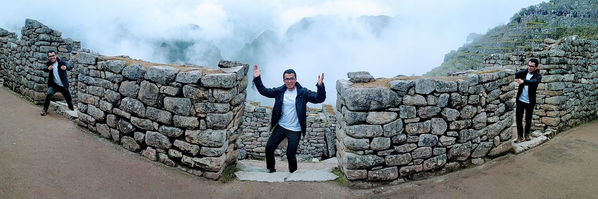

# **JULIÁN FELIPE BENAVIDES NIEVES**
### <h3 style="color:#999999">_**DISEÑADOR INDUSTRIAL / ESPECIALISTA EN PEDAGOGÍA DEL DISEÑO**_</h3>

#

| Behance: [**hey_mono_hey**](https://www.behance.net/hey_mono_hey) |  Twitter: [**pipen77**](https://twitter.com/pipen77) |

 

#

## **SOBRE MÍ**
> *Un resumen corto*

 

**Diseñador industrial** con más de diez años de experiencia en el desarrollo, conceptualización, diseño, planeación, producción e instalación de material de punto de venta, arquitectura efímera y espacios comerciales, además del desarrollo de estrategias de comunicación en punto de venta a través del trabajo en equipo con profesionales de diferentes disciplinas, habiendo trabajado para más de **30 marcas** de productos de consumo masivo. Esta experiencia permite conocer las variables involucradas en los proyectos de comunicación y diseño, desde el levantamiento y la definición de los requerimientos del cliente, pasando por la puesta en marcha de las acciones de comunicación, hasta los procesos de producción y logística de montaje de elementos industriales.

Experiencia en manejo de clientes como ejecutivo de cuenta para agencia de publicidad y de forma independiente, liderando actividades de mercadeo, campañas publicitarias y requerimientos
de servicios de diseño.

**Ocho años de experiencia en docencia** en programas de pregrado y cursos de extensión en Instituciones de Educación Superior, además de participar en la definición de contenidos propios del programa de Diseño Industrial desde la coordinación de la línea de medios. De esta experiencia se deriva un interés por la relación de los medios de producción industrial y visual y las herramientas digitales, especialmente como potenciadores de las habilidades y conocimientos propios de los profesionales
del diseño y que cada vez más se manifiestan como herramientas indispensables para el desarrollo de la profesión del diseñador
o creador y se encuentran de forma ubicua en el producto de estas disciplinas, sino también como transformadores de la relación del diseño con la cultura material.

 
 

#

## **EXPERIENCIA**
 

1. ### [_**UNIVERSIDAD EL BOSQUE**_](https://www.unbosque.edu.co/)
#### **Docente Línea de Medios Ciclo Básico y Específico, 2016 - Presente**
*Encargado: Juan Sebastián Ávila - Coordinador Ciclo Específico*
##### Teléfono: (1) 648 9000 Ext.: 1133 - 1194
Docente y coordinador de asignaturas del ciclo básico y especifico de la línea de medios en el programa de pregrado en Diseño Industrial. Planeación y desarrollo de las sesiones, desde el desarrollo de los contenidos hasta la ejecución de las actividades académicas y lúdicas según los objetivos propuestos por el programa.

 

2. ### [_**360 GRADOS**_](https://360-grados.com/site/)
#### **Director de Proyectos, noviembre de 2014 - diciembre de 2019**
*Encargado: Eduardo Álvarez - Gerente Administrativa*
##### Teléfono: (1) 494 0922
Dirección y coordinación de los proyectos de visibilidad de marca en punto de venta para los clientes, suministrados por el área comercial. Dirección creativa y de arte en el desarrollo de
seguimiento de los procesos adquisición de materias primas, coordinación de producción y logística de instalación. Soporte al área comercial en atención al cliente.

 

3. ### [_**UNIVERSIDAD NACIONAL DE COLOMBIA**_](https://unal.edu.co/)
*Centro de Extensión Académica - Facultad de Artes*
#### **Equipo de Interventoría y Mobiliario, junio de 2016 - enero de 2017**
*Encargado: Aydee Ospina - Coordinador Interventoría Mobiliario y Señalética*
##### Teléfono: (1) 2200 4000 - Ext. 1045
Realizar las actividades en la coordinación de supervisión del contratista encargado de la producción e instalación del mobiliario. Apoyar a la dirección general en las tareas específicas durante
el desarrollo del proyecto. Velar por el cumplimiento en cuanto a las especificaciones técnicas y de diseño del mobiliario del diseñador proyectista. Apoyar a la coordinación de supervisión de señalética. Vigilar los aspectos técnicos de la producción e instalación del mobiliario. Asistir a la dirección del proyecto en
los aspectos técnicos de su área de conocimiento a que haya lugar.

 

4. ### [_**UNIVERSIDAD NACIONAL DE COLOMBIA**_](https://unal.edu.co/)
*Programa de Educación Permanente*
### **Curso Modelado Digital de Producto, 2011 - 2016**
*Encargado: Mercedes Leonor Rodríguez Báez*
##### Teléfono: (1) 316 5000 Ext.: 10930
Desarrollos de cursos de extensión para capacitar a estudiantes, profesionales del diseño y áreas afines, en la representación básica de producto implementando el software de modelado Rhinoceros 5 y el pluging de renderizado Vray como herramientas fundamental para la presentación de proyectos de diseño.

 

5. ### [_**STRAZA**_](http://straza.com.co/)
### **Diseñador Industrial Senior, mayo de 2013 - octubre 2014**
*Encargado: Fernando Medina - Gerente Administrativo*
##### Teléfono: (1) 648 9000 ext.: 1133 - 1194
Dar respuesta a los requerimientos de diseño entregados por el área comercial, empezando por la interpretación del proyecto (briefing), análisis de los aspectos relevantes, desarrollo conceptual y de comunicación, representación digital de la respuesta gráfica o industrial de las propuestas y preparación de la presentación para la entrega al cliente. Además hacer seguimiento del cumplimiento de los procesos establecidos dentro del departamento, incluyendo diligenciamiento de formatos, revisión de planos de cotización, prototipo y producción. Desarrollo y planeación de los procesos de la elaboración de los productos para el desarrollo de prototipos y producción final.

 

6. ### _**NORTE GRÁFICO**_
#### **Ejecutivo de Cuentas, mayo de 2012 - abril de 2013**
*Encargado: Pilar Bolaños - Gerente Administrativa*
##### Teléfono: (1) 530 4310
Encargado de gestionar y liderar los proyectos de los clientes, desde el levantamiento del brief, planteamiento de estrategia para desarrollar el proyecto, evaluar y ajustar el resultado, y hacer la presentación pertinente de los conceptos desarrollados, para campaña publicitarias y actividades de BTL que permiten a los clientes potenciar sus estrategias de mercadeo.

 

7. ### _**ESPACIO ARQUITECTURA INDUSTRIAL**_
#### **Diseñador Freelance, septiembre de 2010 - marzo de 2012**
*Encargado: Jaime Becerra - Gerente General*
##### Teléfono: (1) 625 6422
Desarrollo de propuesta para espacios comerciales, arquitectura efímera, puntos de venta y stands comerciales.

 

8. ### [_**360 GRADOS**_](https://360-grados.com/site/)
#### **Diseñador Industrial, noviembre de 2007 - mayo de 2012**
*Encargado: Eduardo Álvarez - Gerente Administrativa*
##### Teléfono: (1) 494 0922
Diseño de elementos gráficos e industriales de material de punto de venta para soportar los requerimientos de visibilidad que tienes los clientes para cumplir los objetivos de mercadeo de las marcas.

 
 

#

## **EDUCACIÓN**

 

### _**ESPECIALISTA EN PEDAGOGÍA DEL DISEÑO**_
Universidad Nacional de Colombia
##### Bogotá, Colombia. 2014 - 2015

 

### _**FUNDAMENTALS DESIGN & VISUALIZATION**_
Naska Digital
##### Bogotá, Colombia. 2018

 

### **DISEÑADOR INDUSTRIAL**
Universidad Nacional de Colombia
##### Bogotá, Colombia. 2002 - 2007

 

### _**BACHILLER ACADÉMICO**_
Colegio Santo Tomás de Aquino
##### Bogotá, Colombia. 1996 - 2001

 
 

### **OTROS**

 

### _**CURSO CLIL (CONTENT AND LANGUAGE INTEGRATED LEARNING)**_
**Universidad El Bosque**
##### Bogotá, Colombia. Marco - mayo 2020

 

### _**CURSO "DISEÑO DE CURSO INTEGRADO PARA EL APRENDIZAJE SIGNIFICATIVO**_
**Universidad El Bosque**
##### Bogotá, Colombia. Agosto - noviembre 2021

 
 

#

## **REFERENCIAS**

 

### **EDUARDO ÁLVAREZ**
#### *Gerente de Diseño // 360 Grados*
**Contacto: _(57) 310 2544655_**
##### Bogotá D.C.

 

### **LAURA CAROLINA HOLGUÍN POVEDA**
#### *Docente Asociada // Universidad El Bosque*
**Contacto: _(57) 311 2734107_**
##### Bogotá

 

#
#
