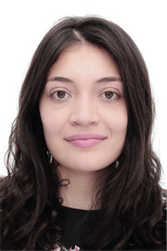

#### Hoja de Vida
# **Milena Ortiz Torres**

 
 
## **Perfil Profesional** 

Dentro de mi experiencia como profesional, he creado una relación directa con el diseño y la tecnología, porque considero que son componentes fundamentales para la creación de herramientas que aportan al cambio. Actualmente, trabajo en el Laboratorio Digital del *Museo de Memoria de Colombia* y mi roll principal es el diseño de interfaces web y móvil y la creación y desarrollo de visualizaciones de datos, lo anterior con el fin de utilizarlas como piezas graficas dentro de los especiales web del Museo.

Para mí el diseño, es una herramienta flexible que pone al límite todos los conocimientos para crear componentes sólidos enfocados a la generación de productos o ideas que reflejen progreso a nivel social, cultural o espacial. 
 
 
[Ver portafolio profesional](https://milenaor.github.io/ )
 
 

## **Herramientas**
 

**_UX/UI_**
 
Adobe XD, Figma.
 
 

**_Diseño_**
 
Adobe Illustrator, Adobe Photoshop, Adobe lnDesign.
 
 

**_Visualización de datos_**
 
Processing, P5, C3.
 
 

**_Visualización de datos_**
 
HTML-CSS

## **Educación**
 

**Arquitectura**
 
Pregrado, Universidad de la Salle, Colombia
##### 2011-2016
 

**Humanidades Digitales**
 
Maestría en curso, Universidad de los Andes, Colombia
##### 2022-Actualmente
 

## **Experiencia Profesional**
 

**Museo de Memoria de Colombia**
 
Diseñadora de interfases Web y Movíl 
##### Colombia, Marzo 2021- Actualidad
 

**Beyond the Book Media**
 
Diseñadora y formateadora de Libros 
##### Estados Unidos, Noviembre 2020- Actualidad
 

**Grupo Verde Ltda**
 
Arquitecta  
##### Colombia, Enero 2020- Agosto 2020
 

**Grupo Verde Ltda**
 
Arquitecta  
##### Colombia, Marzo 2018- Febrero 2019
 

**Universidad Nacional de Colombia**
 
Arquitecta  
##### Colombia, Octubre 2017- Diciembre 2017
 

**Urbanittá**
 
Arquitecta  
##### Colombia, Noviembre 2016- Junio 2017
 

## **Contacto**

amilenaort@gmail.com  

